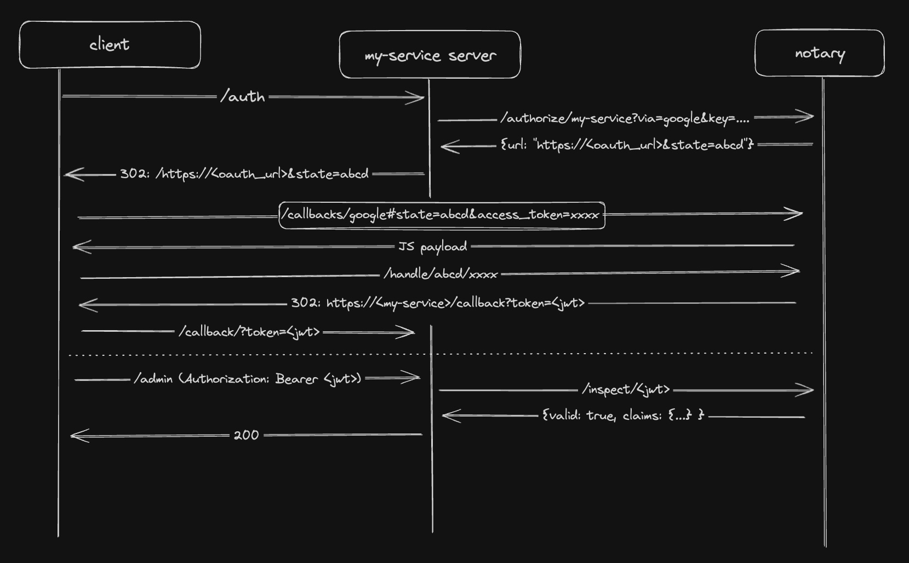

# Notary

A unified server to handle OAuth2 flows across multiple providers for your apps.

## Usage



When a server wants to authenticate a user, it can request that authentication via notary.

For example, for the service "My Service", the server would need a paring of both the service name, as well as the key as they exist in the Notary portal. These serve as the service's credentials to request Notary to authorize users.

```sh
$ curl https://localhost:8080/authorize/:service-name?via=<provider>&key=<key>&callback=<callback>
{"url": "https://accounts.google.com/o/oauth2/auth?client_id=xxxxxxxxx&redirect_uri=https://localhost:8080/callbacks/xxxxxx&scope=openid+email+profile&email&response_type=token&state=ed3b38a092"}
```

> **Note**: That since *Notary* is actually handling the OAuth2 response, the value provided for "callback" is invisible to the OAuth2 provider, so the only actual callback route you need to specify when setting up the OAuth2 ClientID is `https://<your_notary_server>/callbacks/<provider>`.

When a user navigates to this generated URL, they will be prompted to authenticate with the provider listed, and then will be redirected back to *Notary*, which will then look up the final destination based on the "state" id.

Notary will take the incoming `access_token`, validate it, look up the associated user data, and then serialize that data into a signed JWT. The user will finally be redirected to the final destination callback specified in the initial `/authorize/:service-name` request, with the url parameter `?token=<jwt>`

## Creating a Client

Notary is designed to manage your OAuth2 client ids. For now, it only supports Google OAuth. To create a new client go to the [Google Cloud Console](https://console.cloud.google.com/apis/credentials) and click `Create Credential` > `OAuth client ID`. Make sure to set the `Application Type` to `Web Application`.

Make sure to add whatever the hostname of `Notary` is to the "authorized redirect URI" section with the path of `/callbacks/google`. This is the endpoint designed to handle Google OAuth2 flows.

```
Authorized redirect URIs
---
https://notary.example.com/callbacks/google
```

Then, make sure to add the ClientID (just the leading part, not including `.apps.googleusercontent.com`) to Notary. You can do this through the portal accessable via the web server running on port `8080` by default.


Give it a name and a `key`. This key can be anything you want, but it will be used to authenicate any app you have that may want to access this client, so make sure it's secret.

## Hosting

You can host Notary via docker. Due to the large number of enviornment variables needed to be configured, docker compose is recommended.

`$ git clone https://github.com/erwijet/notary`

```yaml
version: "3.8"
services:
  notary:
    build:
      context: ./notary
    ports:
      - 8080:8080
    enviornment:
      POSTGRES_USERNAME: <username>
      POSTGRES_PASSWORD: <password>
      POSTGRES_HOSTAME: <your_server>
      POSTGRES_PORT: 5432

      TOKEN_SECRET: <your_secret> # used to sign issued JWTs
      NOTARY_PASSKEY: <passkey> # used to access the api portal
```

For example, 

Note that the docker image **does not apply database migrations**. To configure your database, run `docker compose exec notary /bin/sh` and then, once in the shell, run `$ mix ecto.migrate` to apply the migrations.

## Module Quick Reference

|Module|Description|
|---|---|
|[`Notary.Registrar`](lib/notary/registrar.ex)|[`Agent`](https://hexdocs.pm/elixir/1.12.3/Agent.html) which manages the state of all of the `CallbackHandle`s that are in-flight.|
|[`Notary.Archivist`](lib/notary/archivist.ex)|[`GenServer`](https://hexdocs.pm/elixir/GenServer.html) which audits [`Notary.Registrar`](lib/notary/registrar.ex) on a regular interval and purges any expired handles|
|[`Notary.Client`](lib/notary/client.ex)|An [`Ecto`](https://hexdocs.pm/typed_ecto_schema/TypedEctoSchema.html) schema representing the client object stored in postgres|
|[`Notary.User`](lib/notary/user.ex)|The common struct to represent user data-- also handles fetching user data via oauth2 access tokens|
|[`Notary.Token`](lib/notary/token.ex)|A [`Joken.Config`](https://hexdocs.pm/joken/Joken.Config.html) for handling JWT logic for notary-issued tokens for clients|
|[`Notary.Router`](lib/notary/router.ex)|HTTP route handles for all core Notary RPCs|
|[`Notary.Portal.Router`](lib/notary/portal/router.ex)|CRUD API for [`Client`](lib/notary/client.ex) objects|
|[`Notary.Portal.Token`](lib/notary/portal/token.ex)|A [`Joken.Config`](https://hexdocs.pm/joken/Joken.Config.html) for handling authenticating `/portal/*` outes|