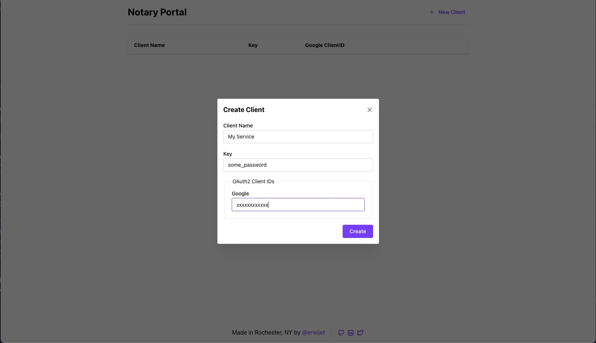

# Notary

A unified server to handle OAuth2 flows across multiple providers for your apps.

## Getting Started

You can host Notary via docker. Due to the large number of enviornment variables needed to be configured, docker compose is recommended.

`$ git clone https://github.com/erwijet/notary`

```yaml
version: "3.8"
services:
  notary:
    build:
      context: ./notary
    ports:
      - 8080:8080 # portal/api endpoint
      - 50052:50052 # GRPC server
    enviornment:
      POSTGRES_USERNAME: <username>
      POSTGRES_PASSWORD: <password>
      POSTGRES_HOSTAME: <your_server>
      POSTGRES_PORT: 5432

      TOKEN_SECRET: <your_secret> # used to sign issued JWTs
      NOTARY_HOSTNAME: <hostname> # hostname where the api is running (including the https://)
      NOTARY_PASSKEY: <passkey> # used to access the api portal
```

Note that the docker image **does not apply database migrations**. To configure your database, run `docker compose exec notary /bin/sh` and then, once in the shell, run `$ mix ecto.migrate` to apply the migrations.

### Creating a Client

Notary is designed to manage your OAuth2 client ids. For now, it only supports Google OAuth. To create a new client go to the [Google Cloud Console](https://console.cloud.google.com/apis/credentials) and click `Create Credential` > `OAuth client ID`. Make sure to set the `Application Type` to `Web Application`.

Make sure to add whatever the hostname of `Notary` is to the "authorized redirect URI" section with the path of `/callbacks/google`. This is the endpoint designed to handle Google OAuth2 flows.

```
Authorized redirect URIs
---
https://notary.example.com/callbacks/google
```

Then, make sure to add the ClientID (just the leading part, not including `.apps.googleusercontent.com`) to Notary. You can do this through the portal accessable via the web server running on port `8080` by default.



Give it a name and a `key`. This key can be anything you want, but it will be used to authenicate any app you have that may want to access this client, so make sure it's secret.

### Authenticating Users